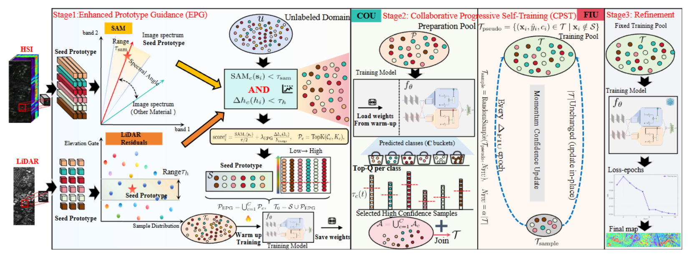

<div align="center">

# Seed-to-Semantics: Few-shot Prototype-Guided Progressive Learning for Hyperspectral and LiDAR Classification

[](https://ieeexplore.ieee.org/document/11602747)
[](https://doi.org/10.1109/TIP.2026.3709522)


Official PyTorch implementation of our paper published in<br>
**IEEE Transactions on Image Processing (TIP), 2026**

Yiyan Zhang, Hongmin Gao, Weiping Ding, Pedram Ghamisi,<br>
Chenkai Zhang, Zhonghao Chen, and Bing Zhang

</div>

## Overview

PGPL is a few-shot learning framework for joint hyperspectral image (HSI) and LiDAR classification. Starting from only a small number of labeled seeds, the method progressively expands reliable supervision and refines the classifier.



## Installation

Clone the repository and install the main dependencies:

```bash
git clone https://github.com/zhangyiyan001/PGPL.git
cd PGPL
```

A CUDA-enabled PyTorch installation is recommended for training. CPU execution is supported but can be considerably slower.


Seed files used in the paper pipeline are already included. To generate a new seed split, run:

```bash
python generate_seeds.py --dataset Houston
python generate_seeds.py --dataset Trento
python generate_seeds.py --dataset MUUFL
```

## Training and Evaluation

Run the complete EPG + CPST pipeline with the dataset-specific patch size:

```bash
# Houston 2013: patch size 11
python main_epg.py --dataset Houston --patch-size 11

# Trento: patch size 7
python main_epg.py --dataset Trento --patch-size 7

# MUUFL Gulfport: patch size 9
python main_epg.py --dataset MUUFL --patch-size 9
```

Dataset settings, EPG thresholds, training schedules, device options, and output paths are defined in `config_epg.py`.

## Citation

We hope this code is helpful to your research. If you use this repository or find our work useful, please consider citing our paper. Your citations are greatly appreciated and help support our future research.

```bibtex
@article{zhang2026seed,
  title   = {Seed-to-Semantics: Few-shot Prototype-Guided Progressive Learning for Hyperspectral and LiDAR Classification},
  author  = {Zhang, Yiyan and Gao, Hongmin and Ding, Weiping and Ghamisi, Pedram and Zhang, Chenkai and Chen, Zhonghao and Zhang, Bing},
  journal = {IEEE Transactions on Image Processing},
  year    = {2026},
  doi     = {10.1109/TIP.2026.3709522}
}
```
